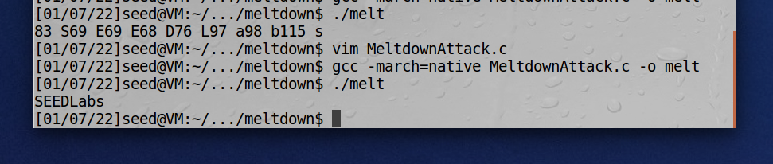
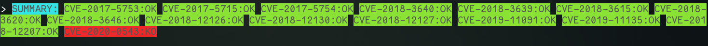
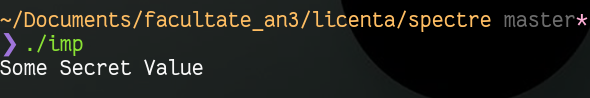

# Speculative-execution-attacks
## Danger of Spectre Attacks

The Spectre attacks exploit hardware issues that cannot be solved through software
without major performance losses.

### Starting off

Starting off, my task is to reproduce the Meltdown attack.

The Meltdown attack is a speciffic category of Spectre attacks that allowed an unprivideged user to gain access to restricted memory.

I'll use the seedlabs metltdown lab.

### Meltdown

##### 1 Reading from Cache versus from Memory

On average cache times fall under are between 50 and 200 CPU cycles.

I defined the threshold as 60% of the average times. If the access time is
lower than that, it is most likely a cache hit.

When the difference is the biggest, usually the cache time is below 100 cycles

##### 2 Using Cache as a Side Channel

Made a script `./test_flush_reload.sh`. For mutiple batches of 20 runs I got
on average 18 / 20 correct cache hits.

##### 3 & 4: Place Secret Data in Kernel Space & try to access it

After placing the secret in kernel space, I tried to access it. The result was
the **expected** Segmentation fault caused by the unhandled SIGSEV signal sent
when we accessed the prohibited memory location.

##### 5: Handle Error/Exceptions in C

Exception handling in C can be done with signal handlers and `setjmp` & `siglongjmp`

##### 6: Out-of-Order Execution by CPU

If we run the code enough times we can see that we got a chach hit on `7`. That means the instructions following the illegal memory access were actually exectued.

##### 7: The Basic Meltdown Attack

###### 7.1
Some very rare cache hits but cannot extract any info from that info. most of them are just random.
Seems like the access time for the kernel_address is too long.

###### 7.2
After loading the kernel buffer in the cache the attack is successful. I'm wondering how can I make the attack successful without manually loading the buffer in cache.

###### Mitigation

Meltdown was mitigated with kernel updates which further isolate the kernel memory from user processes.

### Spectre

Reproducing the Spectre-v1 attack Bounds Check Bypass (BCB)

##### Seps 1->2

These are very similar with steps 1->2 from the meltdown lab

##### Task 3

Executing the original spectre experiment we can observe that we can access an out of bounds array
element by training the cpu branch prediction to take the true route. When we give it an input that
would take the false route, throgh speculative exectuion inside the cpu some code of the true branch
is executed as well, and we can observe this by looking through the CPU-Cache side-channel.

If I don't flush `size` from the cache it works less often, because `size` gets cached and there the
opperations run fast enough and the speculative execution does not start.

If I run with `i + 20` in the training section, we will actually train the CPU branch predictor to
take the `false` branch, which is the opposite of what we want. The exeriment will not succeed in 
this particular case.

##### Task 4

The attack works, but since the success rate is rather low, it is not reliable for actually reading
data. If I try to read all the secret, not just the first letter, the task is next to impossible,
since it misses most of the bytes of data.

##### Task 5

Running the Spectre attack I observed that it always printed 0. It makes sense because if the attack is successful there are actually two cache hits. One on our secret from speculative exectution, and
one from the actual execution, which returns 0 and hits on 0. If we ignore 0, the best result will be
on our secret.

##### Task 6

I had to lower the threshold and run a lot more times to get accurate resulte, but it works.

### Checking my own PC

[meltdown-spectre-checker](https://github.com/speed47/spectre-meltdown-checker)
I used this tool and found out (02.02.2022) my machine is vulnerable to 
* CVE-2020-0543:KO (SRBDS) 

A lot of the vulnerabilities appear to be mittigated:

The CPU on my machine is the `Intel(R) Core(TM) i5-8250U CPU @ 1.60GHz`
The mitigation are only software based since my hardware is vulnerable to the attacks.
##### Observation

On a later run I noticed the following:
* running the binary compiled in the VM on my machine worked
* compiling the code again and running it on my machine does not work anymore

This happens because the mitigations for *Spectre V1* are at the compiler level
[mitigation](https://gcc.gnu.org/onlinedocs/gcc-10.2.0/gcc/Other-Builtins.html#Other-Builtins). Thus the attack can be reproduced on a machine with up to date software, but vulnerable hardware by:
1. using an unpached compiler
2. using a binary compiled with an unpached compiler 
3. turning off the patch in the updated compiler

### Conclusion

Even though Meltdown was mittigated Spectre remains an issue on older hardware.
The **only** complete mitigation for this class of attacks is updating the underlying hardware.

### Resource

[Meltdown Paper](https://meltdownattack.com/meltdown.pdf) (1)  

[POC gihub](https://github.com/IAIK/meltdown) (2)  
[main site](https://meltdownattack.com/) (3)  
[Meltdown Attack Lab](https://seedsecuritylabs.org/Labs_20.04/System/Meltdown_Attack/) (4)  
[vulnerable machine](https://seed.nyc3.cdn.digitaloceanspaces.com/SEEDUbuntu-16.04-32bit.zip) (5)  

[Spectre Paper](https://spectreattack.com/spectre.pdf)  

[check if vulnerable](https://www.cyberciti.biz/faq/check-linux-server-for-spectre-meltdown-vulnerability/)
